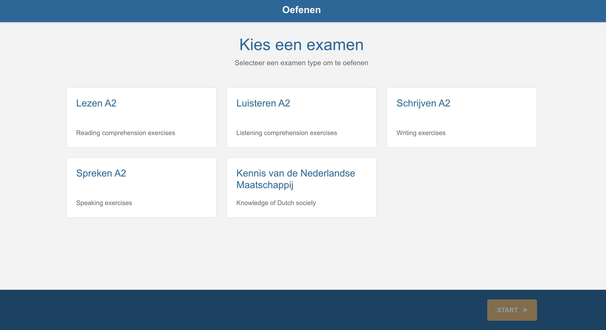
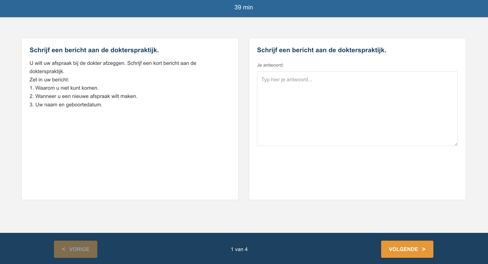
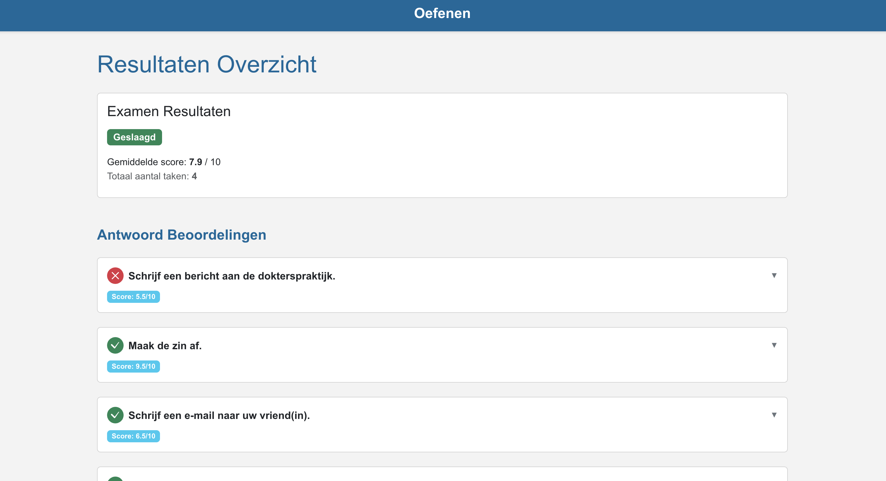

# Exam Oefenen

A practice application for the Dutch Inburgeringsexamen (A2 level). Practice Reading, Listening, Writing, Speaking, and KNM (Knowledge of Dutch Society) exams with AI-powered generation and validation.

## Preview

|                Exam Selection                |              Exam in Progress              |                 Results                  |
| :------------------------------------------: | :----------------------------------------: | :--------------------------------------: |
|  |  |  |

## Setup

### Prerequisites

- Node.js (v18 or higher)
- npm

### Installation

1. Clone the repository:

```bash
git clone <repository-url>
cd exam-oefenen
```

1. Install dependencies:

```bash
npm install
```

This will automatically install dependencies for both the client and server via the `postinstall` script.

### Environment Variables

Create a `.env` file in the project root with the following variables:

```bash
# Required
GEMINI_API_KEY=your_gemini_api_key_here

# Optional
GEMINI_MODEL=gemini-2.5-flash  # Default: gemini-2.5-flash
```

### Running the Application

Start both client and server concurrently:

```bash
npm start
```

This will start:

- **Client** (Angular) on `http://localhost:4400`
- **Server** (Express) on `http://localhost:3000`

To stop all services:

```bash
npm run stop
```
